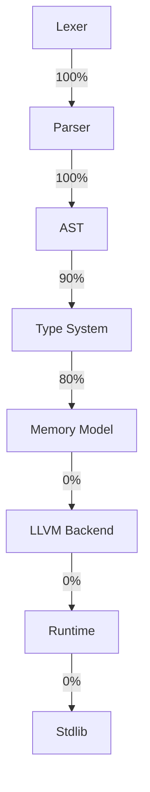
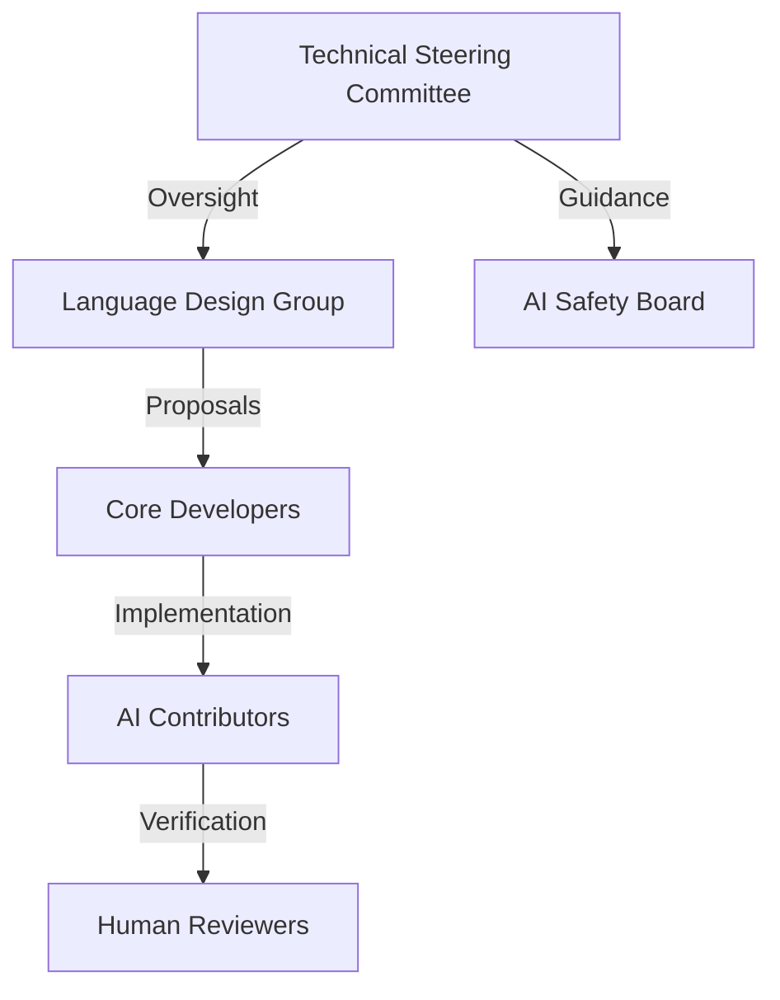

# VeZ Programming Language

## Getting Started

- **Install**: See [docs/INSTALL.md](docs/INSTALL.md) for prebuilt binaries (Linux, macOS Intel/Apple Silicon, Windows) and source builds.
- **AI Tooling**: See [docs/AI_TOOLING.md](docs/AI_TOOLING.md) for LLM-ready context packs and prompts.
- **Quick Start**: `cargo build --workspace --release` then add `target/release` to PATH; run `vezc --version`.
- **Releases**: Tagged builds (`vX.Y.Z`) produce artifacts via GitHub Actions (`.github/workflows/release.yml`).

## Vision

**VeZ** is a revolutionary programming language designed specifically for AI agents to write efficient, low-level code that directly interfaces with CPU, memory, and GPU resources. VeZ eliminates the overhead and complexity of human-centric programming paradigms, enabling AI to generate optimized code with minimal resource usage and maximum performance.

### Technical Implementation
VeZ achieves hardware-level efficiency through:
- **Direct Memory Access Primitives**: `mem[addr:type]` syntax for raw memory operations
- **GPU Compute Shaders**: Native `@gpu` annotation for parallel workloads
- **Deterministic Execution Model**: Guaranteed timing behavior for real-time systems

### Key Use Cases
1. **AI-Generated Systems Programming**:
```zari
@task("create_file_system")
def create_fs(blocks: [u64]) -> Result<FS, Error>:
    alloc layout = MemoryLayout(blocks)
    fs = FileSystem(layout)
    return fs if validate(fs) else Error("Invalid FS")
```

2. **Robotics Control Systems**:
```zari
@realtime(deadline=10ms)
def arm_controller(position: Vector3) -> MotorOutputs:
    torque = calculate_torque(position)
    return apply_pid(torque, kp=0.8, ki=0.1, kd=0.05)
```

3. **High-Performance Computing**:
```zari
@gpu(threads=1024)
def nbody_simulation(particles: [Particle]) -> [Vector3]:
    for i in range(len(particles)):
        acc = zero_vector()
        for j in range(len(particles)):
            if i != j:
                acc += calculate_force(particles[i], particles[j])
        particles[i].acceleration = acc
    return particles
```

## Core Philosophy

**AI-Native Design**: Unlike traditional languages built for human readability, this language is optimized for AI comprehension and generation, allowing for:
- Direct hardware manipulation (CPU, GPU, Memory)
- Minimal abstraction overhead
- Deterministic performance characteristics
- Efficient compilation to machine code
- Native parallel processing support

### AI-Optimized Syntax Examples
1. **Hardware Intrinsics**:
```zari
# Direct CPU instruction invocation
@intrinsic("AVX512")
def vector_add(a: float[16], b: float[16]) -> float[16]:
    return a + b  # Compiles to single VPADDQ instruction
```

2. **Memory Layout Control**:
```zari
struct DataPacket:
    timestamp: u64 @offset(0)
    sensor_id: u32 @offset(8)
    values: f32[8] @offset(16) @aligned(64)
    checksum: u16 @offset(48)
```

3. **Deterministic Resource Management**:
```zari
resource gpu_buffer = @gpu_alloc(size=1MB, flags=READ_WRITE)

def process_data(data: [f32]):
    with gpu_buffer as buf:
        buf << data  # Zero-copy transfer
        result = @gpu_kernel(buf, threads=256)
        return result
```

**Human-AI Interoperability**: While AI-first, the language maintains bridges to existing ecosystems (Python, Java, C++) allowing humans to:
- Interface with AI-generated code
- Provide high-level specifications
- Monitor and validate AI outputs

### Interoperability Examples
1. **Python Binding**:
```python
import vez

# Load VeZ-compiled shared library
fs = vez.load("filesystem.zlib")

# Call AI-generated function
fs.create_partition("ssd0", layout="ext4", size=100GB)
```

2. **Specification Markup**:
```zari
@spec("""
REQUIREMENTS:
- Input: temperature: f32, pressure: f32
- Output: state: {SOLID, LIQUID, GAS}
- Constraints: Must complete in <5μs
""")
def phase_detector(t: f32, p: f32) -> State:
    # AI implements specification
```

3. **Validation Interface**:
```java
// Java validation harness
public class FSTest {
    static { System.loadLibrary("vez_filesystem"); }
    
    @Test
    public void testCreateFS() {
        try (VeZContext ctx = new VeZContext()) {
            FS fs = LibFS.create_fs(blocks);
            assertTrue(fs.isValid());
        }
    }
}
```

## Key Differentiators

1. **Hardware-Level Optimization**: Direct access to CPU instructions, memory management, and GPU compute
   - **Example: SIMD Intrinsics**
     ```zari
     @intrinsic("AVX2")
     def fast_matrix_mult(a: f32[8], b: f32[8]) -> f32[8]:
         return a * b  # Compiles to single VMULPS instruction
     ```
   - **Memory Management**:
     ```zari
     # Allocate 4KB aligned memory
     buffer = @alloc(size=4096, align=4096)
     
     # Direct GPU memory mapping
     gpu_ptr = @gpu_map(buffer)
     ```

2. **AI-Optimized Syntax**: Structured for transformer-based models
   - **Context-Rich Annotations**:
     ```zari
     @task("image_processing", complexity=O(n), hardware="GPU")
     def denoise_image(img: Tensor[u8, 3]) -> Tensor[u8, 3]:
         # AI automatically selects optimal algorithm
         return @auto_denoise(img)
     ```

3. **Deterministic Compilation**: Predictable performance
   - **Execution Timing Guarantees**:
     ```zari
     @timing_guarantee(max=50μs, variance=±2μs)
     def control_loop(sensors: SensorData) -> ActuatorCmd:
         return pid_controller(sensors)
     ```

4. **Zero-Cost Abstractions**:
   - **Compile-Time Evaluation**:
     ```zari
     const PI = 3.1415926535
     
     @compile_time
     def circle_area(r: f32) -> f32:
         return PI * r * r  # Calculated during compilation
     ```

5. **Built-in Parallelism**:
   - **Automatic Task Parallelization**:
     ```zari
     @parallel(schedule="dynamic")
     def process_dataset(data: [Dataset]) -> [Result]:
         for item in data:
             yield transform(item)
     ```

6. **Memory Safety**:
   - **Region-Based Memory Management**:
     ```zari
     region temp_scope:
         temp_buf = @alloc(1024)
         # Automatic deallocation at region end
     ```

## Project Status

**Language**: VeZ (`.zari`)  
**Phase**: Initial Planning & Architecture  
**Version**: 0.1.0-alpha  
**Target**: AI Code Generation Systems (GPT, Claude, Gemini, etc.)

### Detailed Roadmap
| Phase | Timeline | Key Milestones | Status |
|-------|----------|----------------|--------|
| **Foundation** | Q1 2026 | - Lexer/Parser (100%)
- AST Definition (100%)
- Memory Model Spec (80%)
- Type System Design (90%) | 
| **Core Implementation** | Q2-Q3 2026 | - LLVM Backend (0%)
- GPU Compilation Pipeline (0%)
- Basic Runtime (0%)
- Standard Library Foundation (10%) | 
| **Advanced Features** | Q4 2026 | - Deterministic Execution Engine
- AI-Optimization Passes
- Cross-Language Interop
- Formal Verification Tools | 
| **Production Ready** | 2027 | - Toolchain Stabilization
- Performance Optimization
- Security Audits
- Ecosystem Development | 

### Development Progress


### Versioning Scheme
VeZ follows **Semantic Versioning 3.0** with AI-specific extensions:
- **Major**: Breaking changes to AI generation interfaces
- **Minor**: New AI-optimized features
- **Patch**: Bug fixes and performance improvements
- **Extension**: `+ai.<model>` for AI model-specific optimizations (e.g., 1.4.2+ai.gpt5)

## License

VeZ is released under the **MIT License** - see [LICENSE](LICENSE) for details.

Key permissions:
- Commercial use
- Modification
- Distribution
- Private use

Limitations:
- Liability
- Warranty

For alternative licensing options (enterprise, academic), contact licensing@vez.lang

## Contact & Community

### Official Channels
- 🌐 **Website**: [https://vez.lang](https://vez.lang)
- 📬 **Mailing List**: [dev@vez.lang](mailto:dev@vez.lang)
- 💬 **Discord**: [VeZ Developers Hub](https://discord.gg/vez-lang)
- 🐦 **Twitter**: [@vez_lang](https://twitter.com/vez_lang)

### Community Resources
1. **AI Developer Forum**:
   - [Prompt Engineering for VeZ](https://forum.vez.lang/c/ai-prompts)
   - [Hardware Optimization Discussions](https://forum.vez.lang/c/hardware)

2. **Learning Community**:
   - [Weekly AI Pair Programming Sessions](https://learn.vez.lang/events)
   - [VeZ Challenge Problems](https://challenges.vez.lang)

3. **Enterprise Support**:
   - Email: [enterprise@vez.lang](mailto:enterprise@vez.lang)
   - Phone: +1 (555) VEZ-LANG

### Governance Model


### Community Guidelines
1. **AI Contributions**:
   - Must include @spec annotations
   - Provide test coverage metrics
   - Document optimization decisions

2. **Human Contributions**:
   - Follow RFC process for major changes
   - Maintain interoperability bridges
   - Prioritize security and determinism

---

**Note**: VeZ is developed through a unique collaboration between AI systems and human engineers, pushing the boundaries of programming language design.

## Repository Structure

/
├── docs/                    # Comprehensive documentation
│   ├── VISION.md           # Long-term vision and goals
│   ├── ARCHITECTURE.md     # Technical architecture
│   ├── SPECIFICATION.md    # Language specification
│   └── TUTORIALS.md        # Learning resources
├── roadmap/                # Project roadmaps and milestones
│   ├── ROADMAP.md          # Master roadmap
│   ├── PHASE_1.md          # Foundation phase
│   ├── PHASE_2.md          # Core implementation
│   └── PHASE_3.md          # Advanced features
├── spec/                   # Formal language specifications
│   ├── grammar/            # Language grammar definitions
│   ├── semantics/          # Semantic rules
│   └── stdlib/             # Standard library specs
├── compiler/               # Compiler implementation
├── runtime/                # Runtime system
├── stdlib/                 # Standard library
├── tools/                  # Development tools
├── examples/               # Example programs
├── benchmarks/             # Performance benchmarks
└── research/               # Research and experiments

### Detailed Component Breakdown

1. **`docs/`**: Comprehensive project documentation
   - `VISION.md`: Strategic direction and future goals
   - `ARCHITECTURE.md`: Technical design decisions and system components
   - `SPECIFICATION.md`: Formal language grammar and semantics
   - `TUTORIALS.md`: Getting started guides and usage examples

2. **`roadmap/`**: Development planning
   - `ROADMAP.md`: High-level project timeline
   - `PHASE_*.md`: Detailed implementation plans for each development phase

3. **`spec/`**: Formal language definitions
   - `grammar/`: EBNF syntax definitions and parser rules
   - `semantics/`: Type system rules and memory model specifications
   - `stdlib/`: Standard library interface contracts

4. **`compiler/`**: Source-to-binary translation
   - Frontend: Lexer, parser, AST generation
   - Middleend: Optimization passes, AI-specific transformations
   - Backend: LLVM integration, GPU code generation

5. **`runtime/`**: Execution environment
   - Memory allocator with hardware-specific optimizations
   - Deterministic execution scheduler
   - GPU compute management

6. **`stdlib/`**: Standard library implementation
   - Core data structures and algorithms
   - Hardware abstraction interfaces
   - AI helper functions and intrinsics

7. **`tools/`**: Developer tooling
   - LSP server for IDE integration
   - Package manager (vpm)
   - Performance profiler and debugger

8. **`examples/`**: Sample programs
   - Robotics control systems
   - High-performance computing kernels
   - AI-generated system components

9. **`benchmarks/`**: Performance testing
   - Comparison against C/Rust in key workloads
   - AI code generation efficiency metrics
   - Hardware-specific optimization reports

10. **`research/`**: Experimental features
    - Novel AI code generation techniques
    - Hardware acceleration research
    - Formal verification methods

## Quick Start

### Prerequisites
- LLVM 18+ installed
- NVIDIA CUDA Toolkit 12+ (for GPU support)
- Python 3.10+ (for toolchain scripts)

### Installation
```bash
# Clone repository
git clone https://github.com/vezz-lang/vezz
cd vezz

# Build compiler (requires Rust toolchain)
cargo build --release

# Set environment variables
export VEZ_HOME=$(pwd)
export PATH="$VEZ_HOME/target/release:$PATH"
```

### Your First VeZ Program
Create `hello.zari`:
```zari
@entry
def main():
    @syscall(write, 1, "Hello, AI World!\n", 16)
    return 0
```

Compile and run:
```bash
vezc hello.zari -o hello
./hello
# Output: Hello, AI World!
```

### Advanced Example: Parallel Matrix Multiplication
```zari
@gpu(blocks=256, threads_per_block=1024)
def matmul(A: f32[1024,1024], B: f32[1024,1024]) -> C: f32[1024,1024]:
    row = @blockIdx.x * @blockDim.x + @threadIdx.x
    col = @blockIdx.y * @blockDim.y + @threadIdx.y
    
    if row < 1024 and col < 1024:
        sum = 0.0
        for k in range(1024):
            sum += A[row, k] * B[k, col]
        C[row, col] = sum
```

Compile with GPU support:
```bash
vezc matmul.zari -o matmul --target=nvidia-gpu --opt=level3
```

### Toolchain Features
1. **AI-Assisted Optimization**:
   ```bash
   vezc program.zari --ai-optimize=gpt-5 --prompt="Maximize throughput for tensor operations"
   ```

2. **Hardware-Specific Compilation**:
   ```bash
   vezc program.zari --target=intel-avx512 --cpu-features=+avx512f,+avx512cd
   ```

3. **Formal Verification**:
   ```bash
   vezv program.zari --spec=safety_properties.vspec
   ```

### Learning Resources
1. [Interactive Tutorial](https://learn.vez.lang/basics)
2. [Standard Library Reference](https://docs.vez.lang/stdlib)
3. [Hardware Intrinsics Guide](https://docs.vez.lang/intrinsics)
